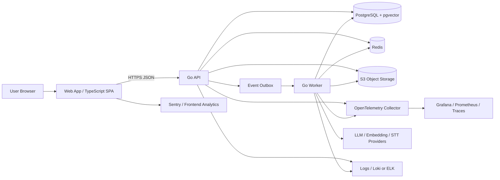
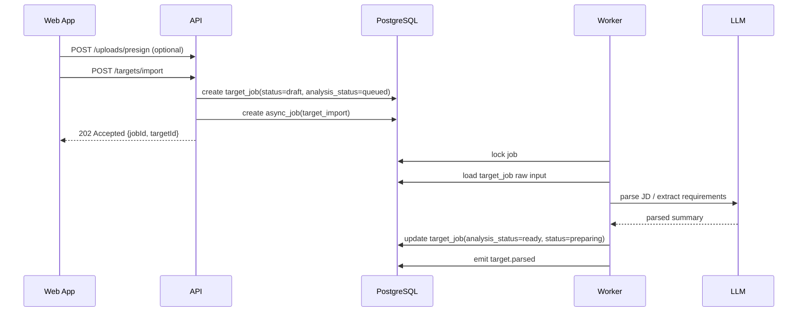
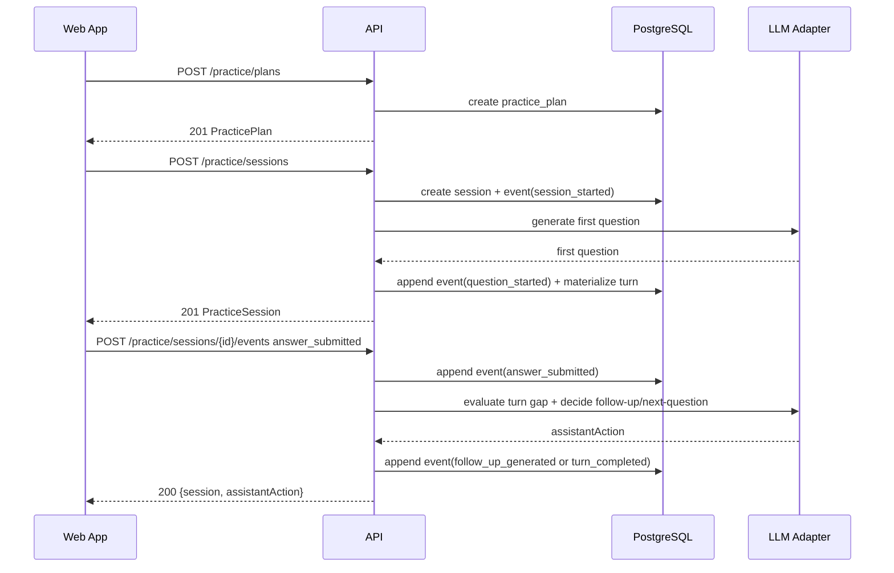
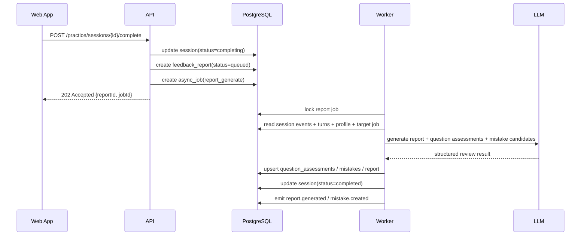
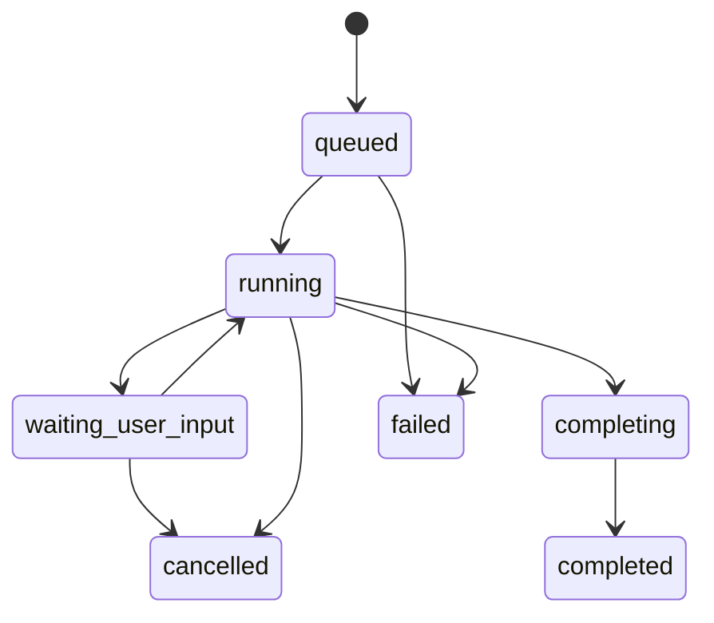

# 01. 技术架构

## 1. 目标与范围

本架构面向 easyinterview 的 P0 / P1 阶段，围绕以下主链路落地：

1. JD 导入与解析
2. 目标岗位工作台
3. 模拟面试计划与会话
4. 逐题观察、报告与错题本
5. 简历定制
6. 真实面试复盘
7. 数据导出 / 删除请求

架构原则来自产品 spec，但实现上采用 **前后端分离 + Go 模块化单体 + 异步 Worker** 的方式，优先保证：

- 同步链路短
- 异步链路可观测
- 模型调用可替换
- 结果可追踪、可解释
- P0 不引入过多基础设施复杂度

---

## 2. 参考技术栈

### 2.1 前端（Web）

推荐但非强绑定：

- React 19 + TypeScript
- Vite
- React Router
- TanStack Query
- Zustand（会话态 / UI 态）
- Zod（运行时校验）
- OpenAPI 生成 TS Client
- Sentry（前端异常）
- PostHog / Segment（产品分析）

### 2.2 后端（API + Worker）

推荐：

- Go 1.24+
- `chi` 作为 HTTP Router
- `pgx + sqlc` 访问 PostgreSQL
- Redis 作为缓存、限流与 Asynq Broker
- Asynq 作为异步任务队列
- OpenTelemetry
- Prometheus + Grafana
- zerolog / zap 输出 JSON 日志

### 2.3 数据与基础设施

- PostgreSQL 16
- `pgvector`（P0 / P1 内嵌向量检索）
- S3 兼容对象存储（AWS S3 / MinIO / R2）
- Loki / ELK（日志）
- Sentry（错误追踪）
- 可选：Nginx / CloudFront / CDN

---

## 3. 总体部署形态

### 3.1 推荐部署

P0 / P1 不建议直接拆成微服务，推荐部署成 3 个运行单元：

1. **web-app**：前端静态资源 / SPA
2. **api**：Go HTTP API 进程
3. **worker**：Go 异步任务进程

共享基础设施：

- PostgreSQL
- Redis
- Object Storage
- 监控 / 日志 / 追踪系统
- 外部 AI Provider

### 3.2 架构图



---

## 4. 运行时组件职责

| 组件 | 职责 | 同步 / 异步 |
|---|---|---|
| Web App | 页面渲染、表单、会话交互、报告展示、前端埋点 | 同步 |
| API | 认证、资源 CRUD、会话状态推进、短链路 AI 调用、对象存储签名 | 同步 |
| Worker | JD 解析、报告生成、简历定制、Source 刷新、隐私任务 | 异步 |
| PostgreSQL | 核心业务数据、事件 outbox、AI 版本记录、pgvector 检索 | 持久化 |
| Redis | 缓存、限流、队列 broker、短期会话加速态 | 临时 |
| S3 | 简历、上传的 JD 文件、导出包、未来音频 / 视频对象 | 持久化 |
| AI Adapter Layer | 模型供应商抽象、重试、fallback、成本记录 | 同步 / 异步 |
| Observability Stack | 指标、日志、trace、告警 | 横切 |

---

## 5. 模块边界（后端）

后端建议采用 **模块化单体**，按业务域拆目录，而不是先按技术层拆成大而泛的 `service/repository/util`。

### 5.1 模块列表

| 模块 | 职责 |
|---|---|
| `auth` | 认证、会话、用户上下文 |
| `profile` | CandidateProfile、ExperienceCard、偏好设置 |
| `upload` | 预签名上传、文件元数据、病毒扫描钩子 |
| `targetjob` | TargetJob、JD 导入、解析状态、来源记录 |
| `practice` | PracticePlan、PracticeSession、事件流、状态机 |
| `review` | QuestionAssessment、FeedbackReport、MistakeEntry |
| `resume` | ResumeAsset、简历解析、JD 定制建议 |
| `debrief` | 真实面试复盘 |
| `retrieval` | pgvector 检索、embedding upsert |
| `ai` | prompt / rubric registry、provider adapters、调用记录 |
| `privacy` | 数据导出 / 删除请求 |
| `audit` | 审计事件 |
| `job` | 异步任务封装、outbox 发布、worker handler |
| `observability` | metrics、trace、request id、日志上下文 |

### 5.2 推荐目录结构

```text
backend/
  cmd/
    api/
    worker/
  internal/
    auth/
    profile/
    upload/
    targetjob/
    practice/
    review/
    resume/
    debrief/
    retrieval/
    ai/
    privacy/
    audit/
    job/
    platform/
      db/
      cache/
      objectstore/
      httpx/
      otel/
      logx/
  migrations/
  openapi/
```

---

## 6. 前端架构

### 6.1 推荐目录结构

```text
frontend/
  src/
    app/
      router/
      providers/
    api/
      generated/
      client/
    features/
      auth/
      profile/
      uploads/
      target-jobs/
      practice/
      reports/
      mistakes/
      resume/
      debriefs/
      growth/
      privacy/
    components/
    hooks/
    stores/
    lib/
    pages/
```

### 6.2 前端状态分层

| 状态 | 工具 | 说明 |
|---|---|---|
| 服务端资源状态 | TanStack Query | TargetJob、Session、Report、Mistake 列表 |
| 本地 UI 状态 | Zustand / React state | 抽屉、过滤器、临时表单 |
| 表单校验 | Zod + React Hook Form | 上传、导入、创建计划等 |
| 埋点 | 单独 analytics client | 不混入业务逻辑 |

### 6.3 页面路由建议

- `/targets`
- `/targets/:targetId`
- `/practice/:sessionId`
- `/reports/:reportId`
- `/mistakes`
- `/resume`
- `/debriefs/:debriefId`
- `/growth`
- `/settings/privacy`

### 6.4 前端交互约束

- 长耗时操作必须可感知：展示 `processing` / `generating` 状态。
- Practice 会话页必须支持：
  - 暂停 / 继续
  - 提示开关
  - 会话恢复
- 报告页先展示结构骨架，再异步填充重内容。
- 不在前端存储完整敏感明文到长期本地缓存；本地持久化仅限必要草稿。

---

## 7. 同步链路与异步链路拆分

### 7.1 同步链路（必须短）

以下链路应尽量保持同步：

- 获取岗位工作台
- 创建练习计划
- 开始会话
- 提交一轮回答并拿到下一步动作
- 获取会话当前状态
- 拉取已生成报告
- 获取错题本列表

### 7.2 异步链路（允许等待）

以下链路默认异步：

- JD 导入与结构化解析
- 简历文件解析
- 报告全文生成
- 简历定制建议生成
- 外部 source 刷新
- embedding upsert
- 导出 / 删除请求

### 7.3 为什么这样拆

1. 用户对 Practice 会话的容忍度最低，必须低延迟。
2. JD 解析 / 报告 / 简历建议属于可轮询结果，适合异步。
3. Worker 统一记录 prompt / rubric / model 版本，便于评估和回归。

---

## 8. 核心链路

### 8.1 JD 导入链路



### 8.2 练习会话链路



### 8.3 报告生成链路



---

## 9. Practice 会话状态机

### 9.1 Session 状态



### 9.2 Turn 生命周期

- `asked`
- `answered`
- `follow_up_requested`
- `assessed`
- `skipped`

说明：

- `practice_session_events` 是真实事件流
- `practice_turns` 是面向业务查询的物化视图
- `question_assessments` 是复盘结果，不应在会话进行时提前当作最终结论

---

## 10. AI 编排层设计

### 10.1 组件

| 组件 | 职责 |
|---|---|
| Prompt Registry | 管理 prompt key、版本、语言、模板 hash |
| Rubric Registry | 管理评估 rubric、维度定义、版本 |
| Context Builder | 汇总 profile / target / mistakes / turns |
| LLM Adapter | 调用供应商、重试、fallback、计费记录 |
| Output Validator | 校验结构化输出，必要时自动修复 |
| Evidence Extractor | 将观察绑定到题目 / 回答片段 |
| Retrieval Layer | 从经验卡、错题、本轮上下文中取相关上下文 |

### 10.2 为什么必须做 Adapter

- 降低供应商绑定风险
- 为不同任务切换模型
- 记录成本与质量差异
- 支持灰度 / A-B / rollback

### 10.3 任务拆分建议

| 任务 | 是否同步 | 说明 |
|---|---|---|
| 首题生成 | 是 | 用户点击开始后立即返回 |
| 追问生成 | 是 | 必须跟随回答上下文 |
| 逐题临时观察 | 可同步轻量 | 只做最小结构，避免阻塞 |
| 整轮报告生成 | 否 | 放 Worker |
| 简历定制 | 否 | 放 Worker |
| source 总结 | 否 | 放 Worker |
| embedding 生成 | 否 | 放 Worker |

### 10.4 结构化输出要求

所有 AI 输出都要经过 schema 校验。若校验失败：

1. 先尝试一次 auto-repair
2. 仍失败则记录 `AI_OUTPUT_INVALID`
3. 进入 fallback：
   - 退回较简单模板
   - 或仅返回最小可用结果
4. 绝不将未校验的任意文本直接写入关键业务字段

---

## 11. 数据存储策略

### 11.1 PostgreSQL

存放：

- 用户、画像、经历卡
- TargetJob 与解析结果
- PracticePlan / Session / Event / Turn
- Report / Mistake / Debrief
- Prompt / Rubric / AI 调用记录
- Async Job / Outbox / Audit / Privacy Request

### 11.2 pgvector

用于：

- JD 摘要向量
- ExperienceCard 检索
- MistakeEntry 相似题复练
- 简历 bullet / 画像摘要检索

P0 / P1 统一放在 PostgreSQL 中，避免早期多套检索栈。

### 11.3 Redis

用于：

- API 限流
- 幂等 key 缓存
- 异步任务 broker
- 会话短缓存（可选）
- 热点数据缓存（如最新工作台摘要）

### 11.4 Object Storage

用于：

- 简历原文件
- 上传的 JD 文件
- 数据导出 zip
- 未来音频 / 视频对象
- 必要时的外部 source 快照

---

## 12. 可靠性设计

### 12.1 失败隔离

- AI 任务失败不应拖垮 API 主线程
- 解析失败不影响用户保留草稿岗位
- 报告失败时仍保留 session 原始事件，可重试生成

### 12.2 Outbox 模式

所有关键异步副作用统一通过 **DB outbox** 触发：

- `target.parsed`
- `practice.completed`
- `report.generated`
- `mistake.created`
- `debrief.created`
- `privacy.requested`

作用：

- 避免“业务写库成功但消息没发出”
- 降低跨组件一致性风险
- 便于重放与补偿

### 12.3 幂等与重试

- 所有 Worker handler 必须幂等
- 通过 `job_id + resource_id + task_type` 控制重复执行
- LLM 重试最多 2 次，避免成本失控
- 外部 provider 超时后允许 fallback 到备用模型

---

## 13. 性能预算（建议）

| 链路 | 目标 |
|---|---|
| 打开工作台接口 P95 | <= 500ms |
| 创建练习计划 P95 | <= 800ms |
| 开始会话首题返回 P95 | <= 4s |
| 提交回答得到下一步动作 P95 | <= 4s |
| JD 导入解析完成 P95 | <= 20s |
| 报告生成完成 P95 | <= 45s（文字模式） |
| 简历定制完成 P95 | <= 30s |

### 13.1 容量假设（P0）

- 日活 1k 以内
- 峰值并发练习会话 < 100
- 单日总 LLM 调用 < 50k
- 单 PostgreSQL + 单 Redis 足够支撑

---

## 14. 安全与隐私

### 14.1 访问控制

- 所有资源按 `user_id` 隔离
- 后端统一做资源级鉴权，不信任前端传入的用户信息
- 后台管理 / 审核工具需独立角色权限，不复用普通用户 token

### 14.2 文件处理

- 上传使用预签名 URL
- 上传完成后回调 API 记录 `file_objects`
- 对简历 / 导出包设置独立 retention policy
- 未来音视频开启时，必须单独 consent

### 14.3 删除与导出

- 删除请求进入异步队列，支持状态跟踪
- 删除至少覆盖：
  - profile
  - resumes
  - target jobs
  - sessions
  - reports
  - mistakes
  - debriefs
  - files
- 日志中不保留足以重建原始内容的明文

---

## 15. 发布与灰度

### 15.1 Feature Flag 建议

- `practice_hint_enabled`
- `resume_tailor_enabled`
- `debrief_enabled`
- `ai_fallback_model_enabled`
- `source_refresh_enabled`
- `p2_voice_mode_enabled`

### 15.2 灰度策略

1. 新 prompt / rubric 先对内部账号灰度
2. 小流量用户开启
3. 比较：
   - 生成成功率
   - 追问相关率
   - 报告投诉率
   - 平均成本
4. 达标后全量

---

## 16. 架构决策结论

P0 / P1 推荐采用：

- **前后端分离**
- **Go 模块化单体**
- **API 进程 + Worker 进程**
- **PostgreSQL + pgvector**
- **Redis + Asynq**
- **S3 对象存储**
- **OpenAPI 契约优先**
- **Outbox 保证异步一致性**
- **Prompt / Rubric / Model 全链路可追踪**

这套架构的核心价值不在“技术炫技”，而在于：
- 先把主链路做稳
- 把 AI 结果变成可解释的工程对象
- 为 P1/P2 的语音、多语言、增长与质量回归留出清晰扩展点
