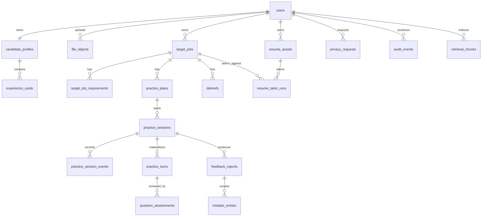

# 03. 数据库定义（PostgreSQL 16 + pgvector）

## 1. 目标

本数据库设计覆盖 P0 / P1 所需核心实体，并满足以下目标：

- 前后端对象模型一致
- 支持异步任务和结果轮询
- 支持 Prompt / Rubric / Model 版本追踪
- 支持错题复练与成长趋势
- 支持 pgvector 语义检索
- 支持审计、导出、删除请求

---

## 2. 建模原则

### 2.1 基本约定

- 数据库：`PostgreSQL 16`
- 启用扩展：`pgvector`
- 主键：`uuid`（由应用生成 UUIDv7）
- 时间：`timestamptz`
- 表 / 列命名：`snake_case`
- 删除策略：
  - 用户核心资源：优先软删（`deleted_at`）
  - 日志 / outbox / job：通常硬删或归档
- `created_at`, `updated_at` 由应用层统一维护
- 面向查询的核心结构尽量规范化
- AI 结果中高变结构使用 `jsonb`

### 2.2 多租户边界

P0 / P1 先按 `user_id` 隔离。若后续进入 Team / EDU 版，可扩展：

- `workspace_id`
- `workspace_members`
- `workspace_role`

当前文档不把多租户复杂度强行前置到核心表。

### 2.3 为什么使用 jsonb

允许使用 `jsonb` 的场景：

- 报告正文与维度结果
- LLM 结构化输出原始副本
- 外部 source 摘要
- AI 调用元数据
- 隐私导出打包清单

不建议把以下字段塞进 `jsonb`：

- 用户 ID、资源状态、时间字段
- 会话 / 岗位 / 简历的核心查询字段
- 错题状态与优先级
- 任何会频繁筛选、排序、关联的字段

---

## 3. 逻辑 ER 图



---

## 4. 表清单

| 表名 | 说明 |
|---|---|
| `users` | 用户主表 |
| `user_settings` | UI 语言、偏好、隐私偏好 |
| `candidate_profiles` | 渐进式画像 |
| `experience_cards` | 结构化经历卡 |
| `file_objects` | 文件元数据 |
| `resume_assets` | 简历资产与解析结果 |
| `target_jobs` | 目标岗位工作台 |
| `target_job_requirements` | 岗位要求拆解 |
| `target_job_sources` | 来源与抓取信息 |
| `practice_plans` | 练习计划 |
| `practice_sessions` | 练习会话 |
| `practice_session_events` | 事件流 |
| `practice_turns` | 物化问题轮次 |
| `question_assessments` | 逐题复盘结果 |
| `feedback_reports` | 报告 |
| `mistake_entries` | 错题本条目 |
| `resume_tailor_runs` | 简历定制结果 |
| `debriefs` | 真实面试复盘 |
| `source_records` | 外部情报 / 来源快照 |
| `retrieval_chunks` | 向量检索块 |
| `prompt_versions` | Prompt 版本登记 |
| `rubric_versions` | Rubric 版本登记 |
| `ai_task_runs` | 模型调用记录 |
| `async_jobs` | 异步任务 |
| `outbox_events` | 事件 outbox |
| `privacy_requests` | 导出 / 删除请求 |
| `audit_events` | 审计事件 |

---

## 5. 核心 DDL

> 说明：以下 DDL 以逻辑设计为主，具体 index、check constraint、trigger 可按迁移脚本再细化。

### 5.1 扩展

```sql
create extension if not exists vector;
```

### 5.2 用户与画像

```sql
create table users (
  id uuid primary key,
  email text not null unique,
  display_name text,
  auth_provider text not null default 'passwordless',
  auth_provider_user_id text,
  status text not null default 'active'
    check (status in ('active', 'disabled', 'deleted')),
  created_at timestamptz not null default now(),
  updated_at timestamptz not null default now(),
  deleted_at timestamptz
);

create table user_settings (
  user_id uuid primary key references users(id),
  ui_language text not null default 'zh-CN',
  preferred_practice_language text not null default 'en',
  region text,
  timezone text not null default 'UTC',
  analytics_opt_in boolean not null default true,
  created_at timestamptz not null default now(),
  updated_at timestamptz not null default now()
);

create table candidate_profiles (
  id uuid primary key,
  user_id uuid not null unique references users(id),
  headline text,
  summary_md text,
  current_role text,
  years_of_experience smallint,
  seniority_level text,
  preferred_practice_language text not null default 'en',
  ui_language text not null default 'zh-CN',
  region text,
  profile_version integer not null default 1,
  created_at timestamptz not null default now(),
  updated_at timestamptz not null default now(),
  deleted_at timestamptz
);

create table experience_cards (
  id uuid primary key,
  user_id uuid not null references users(id),
  profile_id uuid not null references candidate_profiles(id),
  title text not null,
  company_name text,
  situation text,
  task text,
  action text,
  result text,
  metrics jsonb not null default '{}'::jsonb,
  skills text[] not null default '{}'::text[],
  language text not null default 'en',
  source_type text not null default 'manual'
    check (source_type in ('manual', 'resume_parse', 'practice_report', 'debrief')),
  source_ref_id uuid,
  confidence text not null default 'medium'
    check (confidence in ('high', 'medium', 'low')),
  archived_at timestamptz,
  created_at timestamptz not null default now(),
  updated_at timestamptz not null default now()
);

create index idx_experience_cards_user_updated_at
  on experience_cards (user_id, updated_at desc);
create index idx_experience_cards_profile on experience_cards (profile_id);
```

### 5.3 文件与简历

```sql
create table file_objects (
  id uuid primary key,
  user_id uuid not null references users(id),
  purpose text not null
    check (purpose in ('resume', 'target_job_attachment', 'privacy_export', 'source_snapshot', 'audio', 'video')),
  object_key text not null unique,
  original_file_name text not null,
  content_type text not null,
  byte_size bigint not null,
  sha256_hex text,
  retention_policy text not null default 'user_owned'
    check (retention_policy in ('user_owned', 'short_lived', 'legal_hold')),
  upload_status text not null default 'pending'
    check (upload_status in ('pending', 'uploaded', 'scan_failed', 'deleted')),
  created_at timestamptz not null default now(),
  updated_at timestamptz not null default now(),
  deleted_at timestamptz
);

create table resume_assets (
  id uuid primary key,
  user_id uuid not null references users(id),
  file_object_id uuid references file_objects(id),
  title text not null,
  language text not null default 'en',
  parse_status text not null default 'queued'
    check (parse_status in ('queued', 'processing', 'ready', 'failed')),
  parsed_summary jsonb not null default '{}'::jsonb,
  raw_text text,
  latest_parse_job_id uuid,
  created_at timestamptz not null default now(),
  updated_at timestamptz not null default now(),
  deleted_at timestamptz
);

create index idx_resume_assets_user_updated_at
  on resume_assets (user_id, updated_at desc);
```

### 5.4 目标岗位工作台

```sql
create table target_jobs (
  id uuid primary key,
  user_id uuid not null references users(id),
  profile_id uuid references candidate_profiles(id),
  status text not null default 'draft'
    check (status in ('draft', 'preparing', 'applied', 'interviewing', 'offer', 'rejected', 'archived')),
  analysis_status text not null default 'queued'
    check (analysis_status in ('queued', 'processing', 'ready', 'failed')),
  title text,
  company_name text,
  location_text text,
  employment_type text,
  seniority_level text,
  target_language text not null default 'en',
  source_type text not null
    check (source_type in ('manual_text', 'url', 'file', 'manual_form')),
  source_url text,
  source_file_object_id uuid references file_objects(id),
  raw_jd_text text,
  summary jsonb not null default '{}'::jsonb,
  fit_summary jsonb not null default '{}'::jsonb,
  notes text,
  latest_report_id uuid,
  open_mistake_count integer not null default 0,
  created_at timestamptz not null default now(),
  updated_at timestamptz not null default now(),
  deleted_at timestamptz
);

create index idx_target_jobs_user_status_updated
  on target_jobs (user_id, status, updated_at desc);

create index idx_target_jobs_user_analysis_updated
  on target_jobs (user_id, analysis_status, updated_at desc);

create table target_job_requirements (
  id uuid primary key,
  target_job_id uuid not null references target_jobs(id) on delete cascade,
  kind text not null
    check (kind in ('must_have', 'nice_to_have', 'hidden_signal', 'interview_focus')),
  label text not null,
  description text,
  evidence_level text not null default 'explicit'
    check (evidence_level in ('explicit', 'inferred')),
  display_order integer not null default 0,
  created_at timestamptz not null default now()
);

create index idx_target_job_requirements_target_job
  on target_job_requirements (target_job_id, display_order);

create table target_job_sources (
  id uuid primary key,
  target_job_id uuid not null references target_jobs(id) on delete cascade,
  source_type text not null
    check (source_type in ('url', 'file', 'manual_text', 'manual_form')),
  url text,
  file_object_id uuid references file_objects(id),
  snapshot_text text,
  fetched_at timestamptz,
  freshness_status text not null default 'fresh'
    check (freshness_status in ('fresh', 'stale', 'expired')),
  created_at timestamptz not null default now()
);
```

### 5.5 练习计划与会话

```sql
create table practice_plans (
  id uuid primary key,
  user_id uuid not null references users(id),
  target_job_id uuid not null references target_jobs(id),
  source_mistake_id uuid,
  goal text not null
    check (goal in ('baseline', 'sprint', 'fix_mistake', 'debrief')),
  mode text not null
    check (mode in ('warmup', 'core_interview', 'single_drill', 'counter_questions', 'debrief_replay')),
  interviewer_persona text not null
    check (interviewer_persona in ('generalist', 'hr', 'hiring_manager', 'technical_manager', 'peer')),
  difficulty text not null default 'standard'
    check (difficulty in ('easy', 'standard', 'stretch')),
  language text not null default 'en',
  time_budget_minutes smallint not null,
  question_budget smallint not null,
  resume_asset_id uuid references resume_assets(id),
  focus_competency_codes text[] not null default '{}'::text[],
  status text not null default 'ready'
    check (status in ('draft', 'ready', 'archived')),
  created_at timestamptz not null default now(),
  updated_at timestamptz not null default now()
);

create index idx_practice_plans_target_job_created
  on practice_plans (target_job_id, created_at desc);

create table practice_sessions (
  id uuid primary key,
  user_id uuid not null references users(id),
  plan_id uuid not null references practice_plans(id),
  target_job_id uuid not null references target_jobs(id),
  status text not null
    check (status in ('queued', 'running', 'waiting_user_input', 'completing', 'completed', 'failed', 'cancelled')),
  language text not null default 'en',
  hints_enabled boolean not null default false,
  turn_count integer not null default 0,
  started_at timestamptz,
  completed_at timestamptz,
  cancelled_at timestamptz,
  failure_code text,
  created_at timestamptz not null default now(),
  updated_at timestamptz not null default now()
);

create index idx_practice_sessions_target_job_created
  on practice_sessions (target_job_id, created_at desc);

create index idx_practice_sessions_user_status_updated
  on practice_sessions (user_id, status, updated_at desc);

create table practice_session_events (
  id uuid primary key,
  session_id uuid not null references practice_sessions(id) on delete cascade,
  seq_no integer not null,
  event_type text not null
    check (event_type in (
      'session_started',
      'question_started',
      'answer_submitted',
      'hint_requested',
      'follow_up_generated',
      'turn_skipped',
      'turn_completed',
      'session_paused',
      'session_resumed',
      'session_completed'
    )),
  client_event_id text,
  payload jsonb not null default '{}'::jsonb,
  created_at timestamptz not null default now(),
  unique (session_id, seq_no),
  unique (session_id, client_event_id)
);

create index idx_practice_session_events_session_seq
  on practice_session_events (session_id, seq_no);

create table practice_turns (
  id uuid primary key,
  session_id uuid not null references practice_sessions(id) on delete cascade,
  turn_index integer not null,
  question_text text not null,
  question_intent text,
  interviewer_persona text not null,
  status text not null
    check (status in ('asked', 'answered', 'follow_up_requested', 'assessed', 'skipped')),
  answer_text text,
  answer_summary text,
  hint_text text,
  follow_up_count smallint not null default 0,
  asked_at timestamptz not null,
  answered_at timestamptz,
  completed_at timestamptz,
  created_at timestamptz not null default now(),
  updated_at timestamptz not null default now(),
  unique (session_id, turn_index)
);

create index idx_practice_turns_session_turn_index
  on practice_turns (session_id, turn_index);
```

### 5.6 复盘、报告、错题本

```sql
create table feedback_reports (
  id uuid primary key,
  user_id uuid not null references users(id),
  session_id uuid not null references practice_sessions(id),
  target_job_id uuid not null references target_jobs(id),
  status text not null
    check (status in ('queued', 'generating', 'ready', 'failed')),
  preparedness_level text
    check (preparedness_level in ('not_ready', 'needs_practice', 'basically_ready', 'well_prepared')),
  highlights jsonb not null default '[]'::jsonb,
  issues jsonb not null default '[]'::jsonb,
  next_actions jsonb not null default '[]'::jsonb,
  prompt_version text,
  rubric_version text,
  model_id text,
  provider text,
  error_code text,
  generated_at timestamptz,
  created_at timestamptz not null default now(),
  updated_at timestamptz not null default now()
);

create unique index idx_feedback_reports_session_unique
  on feedback_reports (session_id);

create index idx_feedback_reports_target_job_created
  on feedback_reports (target_job_id, created_at desc);

create table question_assessments (
  id uuid primary key,
  report_id uuid not null references feedback_reports(id) on delete cascade,
  session_id uuid not null references practice_sessions(id),
  turn_id uuid not null references practice_turns(id),
  question_intent text,
  overall_status text not null
    check (overall_status in ('strong', 'meets_bar', 'needs_work')),
  confidence text not null
    check (confidence in ('high', 'medium', 'low')),
  strengths jsonb not null default '[]'::jsonb,
  gaps jsonb not null default '[]'::jsonb,
  recommended_framework text,
  dimension_results jsonb not null default '{}'::jsonb,
  written_to_mistake_book boolean not null default false,
  related_experience_card_ids uuid[] not null default '{}'::uuid[],
  created_at timestamptz not null default now(),
  unique (report_id, turn_id)
);

create index idx_question_assessments_session_turn
  on question_assessments (session_id, turn_id);

create table mistake_entries (
  id uuid primary key,
  user_id uuid not null references users(id),
  target_job_id uuid not null references target_jobs(id),
  source_session_id uuid references practice_sessions(id),
  source_report_id uuid references feedback_reports(id),
  source_debrief_id uuid,
  competency_code text not null,
  question_text text not null,
  answer_summary text,
  failure_reasons jsonb not null default '[]'::jsonb,
  recommended_framework text,
  mapped_experience_card_ids uuid[] not null default '{}'::uuid[],
  status text not null default 'open'
    check (status in ('open', 'improving', 'mastered')),
  priority integer not null default 50 check (priority between 1 and 100),
  mastered_at timestamptz,
  created_at timestamptz not null default now(),
  updated_at timestamptz not null default now()
);

create index idx_mistake_entries_user_status_priority
  on mistake_entries (user_id, status, priority desc, updated_at desc);

create index idx_mistake_entries_target_job_status
  on mistake_entries (target_job_id, status, updated_at desc);
```

### 5.7 简历定制与真实面试复盘

```sql
create table resume_tailor_runs (
  id uuid primary key,
  user_id uuid not null references users(id),
  target_job_id uuid not null references target_jobs(id),
  resume_asset_id uuid not null references resume_assets(id),
  mode text not null
    check (mode in ('gap_review', 'bullet_suggestions')),
  status text not null
    check (status in ('queued', 'generating', 'ready', 'failed')),
  match_summary jsonb not null default '{}'::jsonb,
  suggestions jsonb not null default '[]'::jsonb,
  prompt_version text,
  rubric_version text,
  model_id text,
  provider text,
  error_code text,
  generated_at timestamptz,
  created_at timestamptz not null default now(),
  updated_at timestamptz not null default now()
);

create index idx_resume_tailor_runs_target_job_created
  on resume_tailor_runs (target_job_id, created_at desc);

create table debriefs (
  id uuid primary key,
  user_id uuid not null references users(id),
  target_job_id uuid not null references target_jobs(id),
  status text not null
    check (status in ('draft', 'completed')),
  round_type text not null
    check (round_type in ('hr_screen', 'hiring_manager', 'behavioral', 'technical', 'culture', 'custom')),
  interviewer_role text,
  language text not null default 'en',
  raw_questions jsonb not null default '[]'::jsonb,
  notes text,
  risk_items jsonb not null default '[]'::jsonb,
  next_round_checklist jsonb not null default '[]'::jsonb,
  thank_you_draft text,
  prompt_version text,
  rubric_version text,
  model_id text,
  provider text,
  created_at timestamptz not null default now(),
  updated_at timestamptz not null default now()
);

create index idx_debriefs_target_job_created
  on debriefs (target_job_id, created_at desc);
```

### 5.8 Source、向量检索、AI 治理

```sql
create table source_records (
  id uuid primary key,
  user_id uuid references users(id),
  owner_type text not null
    check (owner_type in ('target_job', 'debrief', 'intelligence_item')),
  owner_id uuid not null,
  source_type text not null
    check (source_type in ('jd_url', 'company_page', 'manual_text', 'news', 'upload')),
  title text,
  url text,
  summary jsonb not null default '{}'::jsonb,
  snapshot_file_object_id uuid references file_objects(id),
  fetched_at timestamptz,
  expires_at timestamptz,
  freshness_status text not null default 'fresh'
    check (freshness_status in ('fresh', 'stale', 'expired')),
  created_at timestamptz not null default now()
);

create index idx_source_records_owner
  on source_records (owner_type, owner_id, created_at desc);

create table retrieval_chunks (
  id uuid primary key,
  user_id uuid references users(id),
  owner_type text not null
    check (owner_type in ('target_job', 'experience_card', 'mistake_entry', 'resume_asset', 'debrief')),
  owner_id uuid not null,
  chunk_index integer not null default 0,
  language text not null default 'en',
  content text not null,
  embedding vector(1536) not null,
  metadata jsonb not null default '{}'::jsonb,
  created_at timestamptz not null default now(),
  unique (owner_type, owner_id, chunk_index)
);

create index idx_retrieval_chunks_owner
  on retrieval_chunks (owner_type, owner_id);

create index idx_retrieval_chunks_embedding
  on retrieval_chunks using ivfflat (embedding vector_cosine_ops)
  with (lists = 100);

create table prompt_versions (
  id uuid primary key,
  feature_key text not null,
  version text not null,
  language text not null default 'multi',
  template_hash text not null,
  template_body text not null,
  is_active boolean not null default false,
  created_at timestamptz not null default now(),
  unique (feature_key, version, language)
);

create table rubric_versions (
  id uuid primary key,
  feature_key text not null,
  version text not null,
  language text not null default 'multi',
  schema_json jsonb not null,
  is_active boolean not null default false,
  created_at timestamptz not null default now(),
  unique (feature_key, version, language)
);

create table ai_task_runs (
  id uuid primary key,
  user_id uuid references users(id),
  task_type text not null
    check (task_type in (
      'jd_parse',
      'resume_parse',
      'question_generate',
      'followup_generate',
      'report_generate',
      'resume_tailor',
      'debrief_generate',
      'embedding_upsert'
    )),
  resource_type text not null,
  resource_id uuid not null,
  provider text not null,
  model_id text not null,
  prompt_version text,
  rubric_version text,
  language text not null default 'en',
  input_tokens integer not null default 0,
  output_tokens integer not null default 0,
  latency_ms integer not null default 0,
  cost_usd_micros bigint not null default 0,
  status text not null
    check (status in ('success', 'failed', 'timeout', 'fallback')),
  error_code text,
  raw_response_object_key text,
  metadata jsonb not null default '{}'::jsonb,
  started_at timestamptz not null,
  completed_at timestamptz,
  created_at timestamptz not null default now()
);

create index idx_ai_task_runs_resource
  on ai_task_runs (resource_type, resource_id, created_at desc);

create index idx_ai_task_runs_task_started
  on ai_task_runs (task_type, started_at desc);
```

`ai_task_runs.resource_type` 必须兼容 B2 `ResourceType` API-facing 字面量（`target_job` / `feedback_report` / `resume_asset` / `resume_tailor_run` / `debrief` / `privacy_request`）。内部治理任务可追加更细 resource type，但若该值会经 `GET /api/v1/jobs/{jobId}` 或 OpenAPI fixture 暴露，必须先修订 B2 spec 并 additive 追加 enum。

### 5.9 异步任务与事件 outbox

```sql
create table async_jobs (
  id uuid primary key,
  job_type text not null
    check (job_type in (
      'target_import',
      'resume_parse',
      'report_generate',
      'resume_tailor',
      'debrief_generate',
      'source_refresh',
      'embedding_upsert',
      'privacy_export',
      'privacy_delete'
    )),
  resource_type text not null,
  resource_id uuid not null,
  dedupe_key text,
  status text not null
    check (status in ('queued', 'running', 'succeeded', 'failed', 'cancelled', 'dead')),
  attempts integer not null default 0,
  max_attempts integer not null default 5,
  payload jsonb not null default '{}'::jsonb,
  result jsonb not null default '{}'::jsonb,
  error_code text,
  error_message text,
  available_at timestamptz not null default now(),
  locked_at timestamptz,
  completed_at timestamptz,
  created_at timestamptz not null default now(),
  updated_at timestamptz not null default now()
);

create unique index idx_async_jobs_active_dedupe
  on async_jobs (job_type, dedupe_key)
  where dedupe_key is not null and status in ('queued', 'running');

create index idx_async_jobs_status_available
  on async_jobs (status, available_at);

create table outbox_events (
  id uuid primary key,
  event_name text not null,
  event_version integer not null default 1,
  aggregate_type text not null,
  aggregate_id uuid not null,
  payload jsonb not null,
  publish_status text not null default 'pending'
    check (publish_status in ('pending', 'published', 'failed')),
  published_at timestamptz,
  created_at timestamptz not null default now()
);

create index idx_outbox_events_publish_status_created
  on outbox_events (publish_status, created_at);
```

### 5.10 隐私请求与审计

```sql
create table privacy_requests (
  id uuid primary key,
  user_id uuid not null references users(id),
  request_type text not null
    check (request_type in ('export', 'delete')),
  status text not null
    check (status in ('queued', 'processing', 'completed', 'failed', 'cancelled')),
  export_file_object_id uuid references file_objects(id),
  requested_at timestamptz not null default now(),
  completed_at timestamptz,
  error_code text,
  metadata jsonb not null default '{}'::jsonb
);

create index idx_privacy_requests_user_requested
  on privacy_requests (user_id, requested_at desc);

create table audit_events (
  id uuid primary key,
  user_id uuid,
  actor_type text not null
    check (actor_type in ('user', 'system', 'admin')),
  actor_id uuid,
  action text not null,
  resource_type text not null,
  resource_id uuid,
  result text not null
    check (result in ('success', 'failure')),
  ip_hash text,
  user_agent_hash text,
  metadata jsonb not null default '{}'::jsonb,
  created_at timestamptz not null default now()
);

create index idx_audit_events_user_created
  on audit_events (user_id, created_at desc);

create index idx_audit_events_action_created
  on audit_events (action, created_at desc);
```

---

## 6. 表级说明与设计理由

### 6.1 为什么同时有 `practice_session_events` 与 `practice_turns`

- `practice_session_events`：完整事件流，便于回放、调试、再生成报告
- `practice_turns`：面向业务查询的结构化轮次，便于会话恢复与报告引用

不要只保留事件流，否则前端恢复和报告聚合会复杂；也不要只保留物化结果，否则丢失原始链路证据。

### 6.2 为什么 `feedback_reports` 与 `question_assessments` 分离

- 报告是会话级对象
- 逐题结果是题级对象
- 一题可能被多维评估，但只属于一个 report

### 6.3 为什么 `mistake_entries` 独立存在

错题本不是报告附属字段，而是跨会话复用的学习对象，需要独立：

- 状态流转：`open -> improving -> mastered`
- 复练优先级
- 与岗位 / 能力点关联
- 成长看板统计

### 6.4 为什么 `ai_task_runs` 独立落表

它解决 4 个问题：

1. 成本追踪
2. 质量追踪
3. 回归审计
4. 供应商切换分析

---

## 7. 索引策略

### 7.1 必要 B-Tree 索引

- `user_id + updated_at desc`
- `target_job_id + created_at desc`
- `status + available_at`
- `session_id + seq_no`
- `session_id + turn_index`

### 7.2 向量索引

`retrieval_chunks.embedding` 使用 `ivfflat`：

- P0 数据量不大，足够
- 若召回质量或规模不足，再升级 HNSW 或外部向量库

### 7.3 全文检索（可选）

如果岗位搜索需要标题 / 公司名快速搜索，可补：

```sql
create index idx_target_jobs_fts
on target_jobs
using gin (to_tsvector('simple', coalesce(title, '') || ' ' || coalesce(company_name, '')));
```

---

## 8. 数据保留与删除策略

| 数据 | 默认保留 | 删除说明 |
|---|---|---|
| 用户 / 画像 / 经历卡 | 长期 | 用户删除触发软删 + 异步硬删 |
| JD 原文 | 长期 | 随岗位删除 |
| 练习事件 / 回答 | 长期 | 随用户删除 |
| 报告 / 错题 | 长期 | 随用户删除 |
| 简历文件 | 长期 | 用户可主动删除 |
| 导出包 | 短期 | 默认 7 天自动清理 |
| source 快照 | 中期 | 超过 freshness 可删原文，仅留摘要 |
| 音频 / 视频（P2） | 短期 | 默认自动过期 |

---

## 9. 迁移策略

### 9.1 原则

- 优先 additive migration
- 先加列、双写、切流量、再删旧列
- 不在高频表上做阻塞式大表重写
- 枚举优先 `text + check`，减少 PostgreSQL enum 变更成本

### 9.2 建议工具

- `golang-migrate`
- `goose`
- `atlas`

### 9.3 回滚要求

所有迁移必须说明：

- 是否可逆
- 是否涉及数据回填
- 是否需要业务暂停写入

---

## 10. 后续可扩展点

当前 schema 已给 P2 / P3 留出扩展空间：

- `file_objects.purpose` 可支持音频 / 视频
- `source_records` 可支持轻量公司情报
- `retrieval_chunks.owner_type` 可扩到 question bank
- `ai_task_runs.task_type` 可扩到 STT / Vision
- `privacy_requests` 已覆盖导出 / 删除

如进入 Team / EDU 版，再新增：

- `workspaces`
- `workspace_members`
- `org_templates`
- `aggregated_progress_views`

但不建议在 P0 提前污染核心表。
